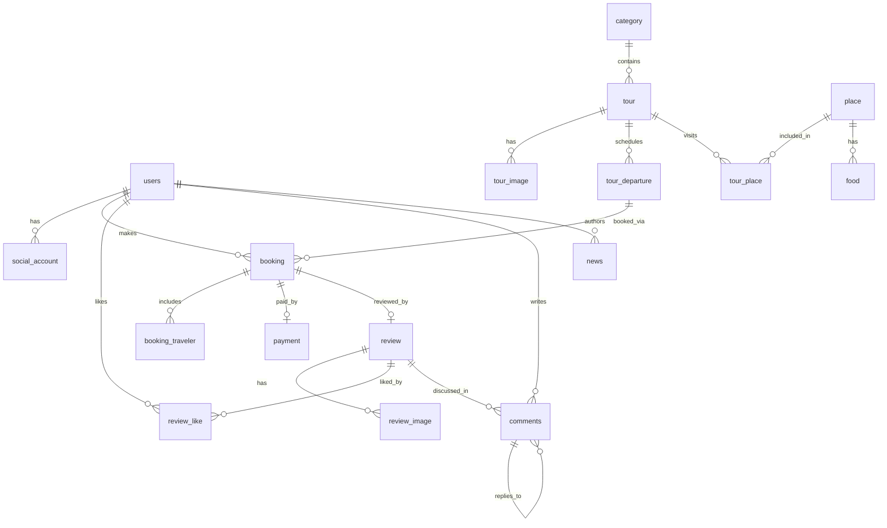

# Mô tả chi tiết Database Schema — SUN Booking Tours

> **Nguồn**: [`database/schema.sql`](file:///c:/Users/ADMIN/Desktop/Booking-sun/database/schema.sql)
> **DBMS**: PostgreSQL
> **Tài liệu tham chiếu**: [spec.md](file:///c:/Users/ADMIN/Desktop/Booking-sun/specs/001-sun-booking-tours/spec.md) · [data-model.md](file:///c:/Users/ADMIN/Desktop/Booking-sun/specs/001-sun-booking-tours/data-model.md) · [plan.md](file:///c:/Users/ADMIN/Desktop/Booking-sun/specs/001-sun-booking-tours/plan.md) · [research.md](file:///c:/Users/ADMIN/Desktop/Booking-sun/specs/001-sun-booking-tours/research.md) · [api-contracts.md](file:///c:/Users/ADMIN/Desktop/Booking-sun/specs/001-sun-booking-tours/contracts/api-contracts.md)

---

## Tổng quan

Schema gồm **15 bảng** được chia thành **5 nhóm chức năng** phục vụ hệ thống đặt tour du lịch trực tuyến:

| # | Nhóm | Bảng | Mục đích |
|---|------|------|----------|
| 1 | User / Account | `users`, `social_account` | Quản lý người dùng & đăng nhập xã hội |
| 2 | Category | `category` | Phân loại tour |
| 3 | Tour System | `tour`, `tour_image`, `tour_departure`, `place`, `tour_place`, `food` | Quản lý tour, lịch khởi hành, địa điểm, ẩm thực |
| 4 | Booking / Payment | `booking`, `booking_traveler`, `payment` | Đặt tour, hành khách, thanh toán |
| 5 | Review / Interaction | `review`, `review_image`, `review_like`, `comments` | Đánh giá, bình luận, tương tác |
| 6 | News | `news` | Tin tức / bài viết |

Tất cả primary key sử dụng kiểu `BIGINT GENERATED BY DEFAULT AS IDENTITY` (auto-increment PostgreSQL). Mọi foreign key đều có index tương ứng ở cuối file schema để tối ưu truy vấn JOIN.

---

## Sơ đồ quan hệ (ERD tổng quát)

---

## Nhóm 1 — User / Account

### Bảng `users`

> **Vai trò nghiệp vụ**: Lưu trữ thông tin tất cả người dùng hệ thống (Guest đã đăng ký → User, Admin). Đây là bảng trung tâm mà hầu hết các bảng khác đều tham chiếu tới.
> **Tham chiếu spec**: FR-001, FR-002, FR-003, FR-004, User Story 1

| Cột | Kiểu | Mô tả |
|-----|------|-------|
| `user_id` | `BIGINT` (PK, auto) | ID định danh duy nhất của người dùng |
| `username` | `VARCHAR` | Tên đăng nhập |
| `password` | `VARCHAR` | Mật khẩu đã hash (BCrypt). **Không lưu plaintext** |
| `full_name` | `VARCHAR` | Họ và tên đầy đủ |
| `email` | `VARCHAR` | Địa chỉ email |
| `phone` | `VARCHAR` | Số điện thoại liên hệ |
| `avatar` | `VARCHAR` | URL ảnh đại diện |
| `role` | `VARCHAR` | Vai trò: `GUEST`, `USER`, `ADMIN` — Phân quyền truy cập |
| `status` | `VARCHAR` | Trạng thái: `ACTIVE`, `INACTIVE`, `BANNED`... |
| `created_at` | `TIMESTAMP` | Thời điểm tạo tài khoản |
| `updated_at` | `TIMESTAMP` | Thời điểm cập nhật gần nhất |

**Nghiệp vụ quan trọng**:
- Cột `role` quyết định phân quyền: Guest chỉ xem, User đặt tour + review, Admin quản trị toàn hệ thống (FR-010, SC-005).
- Password phải được hash qua BCrypt trước khi lưu (theo research.md — Spring Security).
- Bảng này được tham chiếu bởi: `social_account`, `booking`, `review_like`, `comments`, `news`.

---

### Bảng `social_account`

> **Vai trò nghiệp vụ**: Liên kết tài khoản mạng xã hội (Facebook, Twitter/X, Google) với tài khoản hệ thống để hỗ trợ OAuth2 login.
> **Tham chiếu spec**: FR-002, User Story 1 — Social Authentication

| Cột | Kiểu | Mô tả |
|-----|------|-------|
| `social_account_id` | `BIGINT` (PK, auto) | ID bản ghi liên kết |
| `user_id` | `BIGINT` (FK → `users`) | Người dùng sở hữu tài khoản xã hội này |
| `provider` | `VARCHAR` | Nhà cung cấp: `GOOGLE`, `FACEBOOK`, `TWITTER` |
| `provider_uid` | `VARCHAR` | ID duy nhất của user trên provider đó |
| `created_at` | `TIMESTAMP` | Thời điểm liên kết |

**Quan hệ**: `users` (1) → (N) `social_account`
Một user có thể liên kết nhiều tài khoản xã hội khác nhau.

**Flow** (theo research.md §7):
1. React redirect user tới provider.
2. Spring Security OAuth2 Client xử lý authorization flow.
3. Backend nhận identity → tạo/mapping User + SocialAccount.
4. Backend phát hành JWT cookie.

---

## Nhóm 2 — Category

### Bảng `category`

> **Vai trò nghiệp vụ**: Phân loại tour du lịch theo danh mục (VD: Tour biển, Tour núi, Tour văn hóa...). Admin quản lý danh mục.
> **Tham chiếu spec**: FR-010, User Story 5

| Cột | Kiểu | Mô tả |
|-----|------|-------|
| `category_id` | `BIGINT` (PK, auto) | ID danh mục |
| `name` | `VARCHAR` | Tên danh mục |
| `description` | `TEXT` | Mô tả chi tiết danh mục |
| `created_at` | `TIMESTAMP` | Thời điểm tạo |
| `updated_at` | `TIMESTAMP` | Thời điểm cập nhật |

**Quan hệ**: `category` (1) → (N) `tour`

---

## Nhóm 3 — Tour System

### Bảng `tour`

> **Vai trò nghiệp vụ**: Bảng trung tâm của hệ thống — lưu thông tin tour du lịch. Đây là thực thể chính mà người dùng tìm kiếm, xem, đặt, và đánh giá.
> **Tham chiếu spec**: FR-005, FR-006, User Story 2, User Story 3

| Cột | Kiểu | Mô tả |
|-----|------|-------|
| `tour_id` | `BIGINT` (PK, auto) | ID tour |
| `category_id` | `BIGINT` (FK → `category`) | Danh mục mà tour thuộc về |
| `name` | `VARCHAR` | Tên tour |
| `description` | `TEXT` | Mô tả chi tiết tour |
| `base_price` | `NUMERIC` | Giá cơ bản (giá tham khảo, giá thực tế theo `tour_departure`) |
| `departure` | `VARCHAR` | Nơi khởi hành (VD: "TP.HCM", "Hà Nội") |
| `destination` | `VARCHAR` | Điểm đến chính |
| `duration` | `VARCHAR` | Thời gian tour (VD: "3 ngày 2 đêm") |
| `status` | `VARCHAR` | Trạng thái: `ACTIVE`, `INACTIVE`, `DRAFT`... |
| `start_date` | `TIMESTAMP` | Ngày bắt đầu mùa tour |
| `end_date` | `TIMESTAMP` | Ngày kết thúc mùa tour |
| `created_at` | `TIMESTAMP` | Thời điểm tạo |
| `updated_at` | `TIMESTAMP` | Thời điểm cập nhật |

**Nghiệp vụ quan trọng**:
- `base_price` là giá tham khảo. Giá thực tế thanh toán nằm ở `tour_departure.price` cho từng lịch khởi hành cụ thể.
- Tìm kiếm tour (FR-005) sẽ query trên bảng này kết hợp filter theo `category_id`, `destination`, `status`, `departure`...
- Bảng liên kết: `tour_image` (ảnh), `tour_departure` (lịch khởi hành), `tour_place` (địa điểm tham quan).

---

### Bảng `tour_image`

> **Vai trò nghiệp vụ**: Lưu trữ nhiều ảnh cho một tour (gallery ảnh).

| Cột | Kiểu | Mô tả |
|-----|------|-------|
| `image_id` | `BIGINT` (PK, auto) | ID ảnh |
| `tour_id` | `BIGINT` (FK → `tour`) | Tour sở hữu ảnh này |
| `image_url` | `VARCHAR` | URL/path ảnh |
| `created_at` | `TIMESTAMP` | Thời điểm upload |
| `updated_at` | `TIMESTAMP` | Thời điểm cập nhật |

**Quan hệ**: `tour` (1) → (N) `tour_image`

---

### Bảng `tour_departure`

> **Vai trò nghiệp vụ**: Mỗi tour có thể có **nhiều lịch khởi hành** khác nhau. Đây là đơn vị mà user thực sự đặt chỗ — mỗi departure có ngày đi, ngày về, giá riêng, và số lượng chỗ.
> **Tham chiếu spec**: FR-006, FR-007, User Story 3 — Booking & Payment flow

| Cột | Kiểu | Mô tả |
|-----|------|-------|
| `departure_id` | `BIGINT` (PK, auto) | ID lịch khởi hành |
| `tour_id` | `BIGINT` (FK → `tour`) | Tour tương ứng |
| `departure_date` | `DATE` | Ngày khởi hành |
| `return_date` | `DATE` | Ngày trở về |
| `price` | `NUMERIC` | **Giá thực tế** cho lịch khởi hành này |
| `total_slot` | `INTEGER` | Tổng số chỗ |
| `available_slot` | `INTEGER` | Số chỗ còn trống |
| `status` | `VARCHAR` | Trạng thái: `OPEN`, `FULL`, `CLOSED`, `DEPARTED`... |
| `created_at` | `TIMESTAMP` | Thời điểm tạo |
| `updated_at` | `TIMESTAMP` | Thời điểm cập nhật |

**Nghiệp vụ quan trọng**:
- `available_slot` được **tạm giữ (reserve)** 15 phút khi user bắt đầu checkout SePay. Nếu không thanh toán trong 15 phút → trả lại chỗ (theo spec §Edge Cases và research.md §8).
- Xử lý đồng thời (concurrent booking): dùng cơ chế tạm giữ capacity để tránh overbooking.
- Booking liên kết tới `tour_departure` (không phải trực tiếp tới `tour`).

---

### Bảng `place`

> **Vai trò nghiệp vụ**: Các địa điểm tham quan — là thực thể nội dung đọc độc lập mà Guest/User có thể xem (FR-005).

| Cột | Kiểu | Mô tả |
|-----|------|-------|
| `place_id` | `BIGINT` (PK, auto) | ID địa điểm |
| `name` | `VARCHAR` | Tên địa điểm |
| `description` | `TEXT` | Mô tả |
| `address` | `VARCHAR` | Địa chỉ cụ thể |
| `city` | `VARCHAR` | Thành phố |
| `image_url` | `VARCHAR` | Ảnh đại diện |
| `status` | `VARCHAR` | Trạng thái |
| `created_at` | `TIMESTAMP` | Thời điểm tạo |
| `updated_at` | `TIMESTAMP` | Thời điểm cập nhật |

---

### Bảng `tour_place` (Bảng trung gian)

> **Vai trò nghiệp vụ**: Bảng liên kết N-N giữa `tour` và `place`. Mỗi record cho biết tour nào ghé thăm địa điểm nào, vào **ngày thứ mấy** (`day_number`) và **thứ tự tham quan** (`visit_order`).

| Cột | Kiểu | Mô tả |
|-----|------|-------|
| `tour_place_id` | `BIGINT` (PK, auto) | ID bản ghi |
| `tour_id` | `BIGINT` (FK → `tour`) | Tour |
| `place_id` | `BIGINT` (FK → `place`) | Địa điểm |
| `day_number` | `INTEGER` | Ngày thứ mấy trong hành trình (VD: 1, 2, 3) |
| `visit_order` | `INTEGER` | Thứ tự tham quan trong ngày đó |
| `description` | `TEXT` | Mô tả hoạt động tại địa điểm |
| `created_at` | `TIMESTAMP` | Thời điểm tạo |

**Quan hệ**: `tour` (N) ↔ (N) `place` thông qua `tour_place`

**Ứng dụng**: Xây dựng **lịch trình chi tiết** cho tour — "Ngày 1: Tham quan A → B → C; Ngày 2: D → E..."

---

### Bảng `food`

> **Vai trò nghiệp vụ**: Các món ăn đặc sản tại một địa điểm. Là thực thể nội dung đọc độc lập (FR-005 — "view information about food").

| Cột | Kiểu | Mô tả |
|-----|------|-------|
| `food_id` | `BIGINT` (PK, auto) | ID món ăn |
| `place_id` | `BIGINT` (FK → `place`) | Địa điểm có món ăn này |
| `name` | `VARCHAR` | Tên món ăn |
| `description` | `TEXT` | Mô tả |
| `price` | `NUMERIC` | Giá tham khảo |
| `image_url` | `VARCHAR` | Ảnh món ăn |
| `status` | `VARCHAR` | Trạng thái |
| `created_at` | `TIMESTAMP` | Thời điểm tạo |
| `updated_at` | `TIMESTAMP` | Thời điểm cập nhật |

**Quan hệ**: `place` (1) → (N) `food`

---

## Nhóm 4 — Booking / Payment

### Bảng `booking`

> **Vai trò nghiệp vụ**: Ghi nhận việc đặt tour. Một User đặt một `tour_departure` cụ thể. Đây là bảng nghiệp vụ lõi — liên kết user, tour departure, thông tin liên hệ, và thanh toán.
> **Tham chiếu spec**: FR-006, FR-007, FR-008, User Story 3

| Cột | Kiểu | Mô tả |
|-----|------|-------|
| `booking_id` | `BIGINT` (PK, auto) | ID đặt tour |
| `user_id` | `BIGINT` (FK → `users`) | Người đặt tour |
| `departure_id` | `BIGINT` (FK → `tour_departure`) | Lịch khởi hành được đặt |
| `booking_date` | `TIMESTAMP` | Thời điểm đặt |
| `number_of_people` | `INTEGER` | Số người tham gia |
| `total_price` | `NUMERIC` | Tổng giá trị đơn đặt |
| `contact_name` | `VARCHAR` | Tên người liên hệ |
| `contact_phone` | `VARCHAR` | SĐT liên hệ |
| `contact_email` | `VARCHAR` | Email liên hệ |
| `status` | `VARCHAR` | Trạng thái: `PENDING`, `CONFIRMED`, `CANCELLED`, `EXPIRED`... |
| `created_at` | `TIMESTAMP` | Thời điểm tạo |
| `updated_at` | `TIMESTAMP` | Thời điểm cập nhật |

**Nghiệp vụ quan trọng**:
- `status` workflow: `PENDING` → (thanh toán thành công qua SePay webhook) → `CONFIRMED`. Hoặc `PENDING` → (hết 15 phút chưa thanh toán) → `EXPIRED`. Hoặc `CONFIRMED` → (Admin/User huỷ) → `CANCELLED`.
- `contact_*` cho phép người đặt tour điền thông tin liên hệ khác với thông tin tài khoản.
- `number_of_people` tương ứng với số bản ghi trong `booking_traveler`.
- Mỗi booking chỉ có thể tạo **đúng 1 review** (constraint `UNIQUE(booking_id)` trên bảng `review`).

---

### Bảng `booking_traveler`

> **Vai trò nghiệp vụ**: Chi tiết từng hành khách trong một booking. Một booking có thể có nhiều hành khách.

| Cột | Kiểu | Mô tả |
|-----|------|-------|
| `traveler_id` | `BIGINT` (PK, auto) | ID hành khách |
| `booking_id` | `BIGINT` (FK → `booking`) | Booking mà hành khách thuộc về |
| `full_name` | `VARCHAR` | Họ tên hành khách |
| `gender` | `VARCHAR` | Giới tính: `MALE`, `FEMALE`, `OTHER` |
| `date_of_birth` | `DATE` | Ngày sinh |
| `phone` | `VARCHAR` | SĐT |
| `traveler_type` | `VARCHAR` | Loại: `ADULT`, `CHILD`, `INFANT` — ảnh hưởng giá |
| `created_at` | `TIMESTAMP` | Thời điểm tạo |
| `updated_at` | `TIMESTAMP` | Thời điểm cập nhật |

**Quan hệ**: `booking` (1) → (N) `booking_traveler`

---

### Bảng `payment`

> **Vai trò nghiệp vụ**: Ghi nhận giao dịch thanh toán SePay VietQR cho booking. **Chỉ backend mới được cập nhật trạng thái thanh toán thông qua SePay Webhook** — frontend không được phép đánh dấu thanh toán thành công.
> **Tham chiếu spec**: FR-007, User Story 3, research.md §8

| Cột | Kiểu | Mô tả |
|-----|------|-------|
| `payment_id` | `BIGINT` (PK, auto) | ID thanh toán |
| `booking_id` | `BIGINT` (FK → `booking`) | Booking tương ứng |
| `amount` | `NUMERIC` | Số tiền thanh toán |
| `payment_method` | `VARCHAR` | Phương thức: `SEPAY_VIETQR` |
| `transaction_code` | `VARCHAR` | Mã giao dịch duy nhất (dùng để match SePay webhook) |
| `payment_date` | `TIMESTAMP` | Thời điểm thanh toán thành công |
| `status` | `VARCHAR` | Trạng thái: `PENDING`, `SUCCESS`, `FAILED`, `EXPIRED` |
| `created_at` | `TIMESTAMP` | Thời điểm tạo |
| `updated_at` | `TIMESTAMP` | Thời điểm cập nhật |

**Nghiệp vụ quan trọng**:
- **Doanh thu (Revenue)** được tính bằng cách `SUM(amount) WHERE status = 'SUCCESS'` — không cần bảng riêng (research.md §9).
- `transaction_code` là mã unique nhúng vào VietQR để SePay webhook match lại với payment record.
- Flow thanh toán:
  1. User checkout → Backend tạo `payment` với `status = PENDING`, reserve capacity 15 phút.
  2. User quét QR thanh toán qua banking app.
  3. SePay gọi webhook `POST /api/payments/webhook`.
  4. Backend verify webhook signature → match `transaction_code` → cập nhật `status = SUCCESS`.
  5. Nếu 15 phút chưa thanh toán → `status = EXPIRED`, trả chỗ.

> [!CAUTION]
> Schema hiện tại có index `idx_payment_bank_account_id ON payment(bank_account_id)` nhưng **bảng `bank_account` và cột `bank_account_id` không tồn tại trong schema**. Đây là phần đã bị loại bỏ theo yêu cầu (data-model.md §Schema Modifications) nhưng index chưa được dọn dẹp. Cần xoá index này.

---

## Nhóm 5 — Review / Interaction

### Bảng `review`

> **Vai trò nghiệp vụ**: Đánh giá tour — mỗi booking chỉ được phép tạo **đúng 1 review** (ràng buộc `UNIQUE(booking_id)`). Review gắn với booking chứ không gắn trực tiếp với tour.
> **Tham chiếu spec**: FR-009, User Story 4

| Cột | Kiểu | Mô tả |
|-----|------|-------|
| `review_id` | `BIGINT` (PK, auto) | ID đánh giá |
| `booking_id` | `BIGINT` (FK → `booking`, **UNIQUE**) | Booking tương ứng — **1 booking chỉ 1 review** |
| `content` | `TEXT` | Nội dung đánh giá |
| `rating` | `INTEGER` | Điểm đánh giá (VD: 1–5 sao). Đây chính là thực thể "Rating" trong spec |
| `created_at` | `TIMESTAMP` | Thời điểm tạo |
| `updated_at` | `TIMESTAMP` | Thời điểm cập nhật |

**Ràng buộc đặc biệt**: `CONSTRAINT uq_review_booking UNIQUE (booking_id)` — đảm bảo 1 booking → tối đa 1 review.

**Nghiệp vụ**: Để lấy review của một tour cụ thể: `review` → `booking` → `tour_departure` → `tour`.

---

### Bảng `review_image`

> **Vai trò nghiệp vụ**: Ảnh đính kèm cho một review.

| Cột | Kiểu | Mô tả |
|-----|------|-------|
| `image_id` | `BIGINT` (PK, auto) | ID ảnh |
| `review_id` | `BIGINT` (FK → `review`) | Review sở hữu ảnh |
| `image_url` | `VARCHAR` | URL ảnh |
| `created_at` | `TIMESTAMP` | Thời điểm upload |

**Quan hệ**: `review` (1) → (N) `review_image`

---

### Bảng `review_like`

> **Vai trò nghiệp vụ**: Ghi nhận việc User "thích" một review (FR-009).

| Cột | Kiểu | Mô tả |
|-----|------|-------|
| `like_id` | `BIGINT` (PK, auto) | ID lượt thích |
| `review_id` | `BIGINT` (FK → `review`) | Review được thích |
| `user_id` | `BIGINT` (FK → `users`) | User thực hiện like |
| `created_at` | `TIMESTAMP` | Thời điểm like |

**Quan hệ**: `review` (1) → (N) `review_like` ← (N) `users`

> [!NOTE]
> Hiện chưa có constraint `UNIQUE(review_id, user_id)` để ngăn user like nhiều lần cùng 1 review. Logic này cần xử lý ở tầng application hoặc bổ sung constraint.

---

### Bảng `comments`

> **Vai trò nghiệp vụ**: Bình luận trên review — hỗ trợ **cấu trúc cây (threaded comments)** qua `parent_comment_id` tự tham chiếu. User có thể comment trên review hoặc reply vào comment khác.
> **Tham chiếu spec**: FR-009, User Story 4

| Cột | Kiểu | Mô tả |
|-----|------|-------|
| `comment_id` | `BIGINT` (PK, auto) | ID bình luận |
| `review_id` | `BIGINT` (FK → `review`) | Review mà comment thuộc về |
| `user_id` | `BIGINT` (FK → `users`) | User viết comment |
| `parent_comment_id` | `BIGINT` (FK → `comments`, **nullable**) | Comment cha — `NULL` nếu là comment gốc |
| `content` | `TEXT` | Nội dung bình luận |
| `created_at` | `TIMESTAMP` | Thời điểm tạo |
| `updated_at` | `TIMESTAMP` | Thời điểm cập nhật |

**Cấu trúc threaded**:
- `parent_comment_id = NULL` → Comment trực tiếp trên review (comment gốc).
- `parent_comment_id = <id>` → Reply vào comment khác (comment con).
- Quan hệ tự tham chiếu: `comments` (1) → (N) `comments`.

---

## Nhóm 6 — News

### Bảng `news`

> **Vai trò nghiệp vụ**: Bài viết tin tức / blog do Admin/Author đăng. Là thực thể nội dung đọc độc lập (FR-005).

| Cột | Kiểu | Mô tả |
|-----|------|-------|
| `news_id` | `BIGINT` (PK, auto) | ID bài viết |
| `author_id` | `BIGINT` (FK → `users`) | Tác giả (Admin/User có quyền) |
| `title` | `VARCHAR` | Tiêu đề bài viết |
| `summary` | `TEXT` | Tóm tắt nội dung |
| `content` | `TEXT` | Nội dung đầy đủ |
| `thumbnail_url` | `VARCHAR` | Ảnh thumbnail |
| `status` | `VARCHAR` | Trạng thái: `DRAFT`, `PUBLISHED`, `ARCHIVED`... |
| `published_at` | `TIMESTAMP` | Thời điểm xuất bản |
| `created_at` | `TIMESTAMP` | Thời điểm tạo |
| `updated_at` | `TIMESTAMP` | Thời điểm cập nhật |

---

## Indexes

Schema định nghĩa **17 indexes** trên tất cả foreign key để tối ưu hiệu năng truy vấn JOIN:

| Index | Bảng | Cột | Mục đích |
|-------|------|-----|----------|
| `idx_social_account_user_id` | `social_account` | `user_id` | Tìm social accounts của user |
| `idx_bank_account_user_id` | `bank_account` | `user_id` | ⚠️ **LỖI** — bảng `bank_account` không tồn tại |
| `idx_tour_category_id` | `tour` | `category_id` | Lọc tour theo danh mục |
| `idx_tour_image_tour_id` | `tour_image` | `tour_id` | Lấy ảnh của tour |
| `idx_tour_departure_tour_id` | `tour_departure` | `tour_id` | Lấy lịch khởi hành của tour |
| `idx_tour_place_tour_id` | `tour_place` | `tour_id` | Lấy địa điểm trong hành trình tour |
| `idx_tour_place_place_id` | `tour_place` | `place_id` | Tìm tour nào ghé thăm địa điểm |
| `idx_food_place_id` | `food` | `place_id` | Lấy món ăn tại một địa điểm |
| `idx_booking_user_id` | `booking` | `user_id` | Lấy booking của user |
| `idx_booking_departure_id` | `booking` | `departure_id` | Lấy booking theo lịch khởi hành |
| `idx_booking_traveler_booking_id` | `booking_traveler` | `booking_id` | Lấy hành khách theo booking |
| `idx_payment_booking_id` | `payment` | `booking_id` | Lấy thanh toán theo booking |
| `idx_payment_bank_account_id` | `payment` | `bank_account_id` | ⚠️ **LỖI** — cột `bank_account_id` không tồn tại |
| `idx_review_image_review_id` | `review_image` | `review_id` | Lấy ảnh của review |
| `idx_review_like_review_id` | `review_like` | `review_id` | Đếm/lấy like của review |
| `idx_review_like_user_id` | `review_like` | `user_id` | Kiểm tra user đã like chưa |
| `idx_comment_review_id` | `comments` | `review_id` | Lấy comments của review |
| `idx_comment_user_id` | `comments` | `user_id` | Lấy comments của user |
| `idx_comment_parent_id` | `comments` | `parent_comment_id` | Load thread replies |
| `idx_news_author_id` | `news` | `author_id` | Lấy bài viết theo tác giả |

---

## Các vấn đề cần lưu ý

> [!WARNING]
> ### 1. Tàn dư `bank_account`
> Hai index tham chiếu tới bảng/cột `bank_account` đã bị xoá khỏi scope (data-model.md):
> - `idx_bank_account_user_id ON bank_account(user_id)` — bảng `bank_account` không tồn tại
> - `idx_payment_bank_account_id ON payment(bank_account_id)` — cột `bank_account_id` không tồn tại trong bảng `payment`
>
> **Chạy schema.sql sẽ bị lỗi tại 2 dòng này.**

> [!NOTE]
> ### 2. Thiếu UNIQUE constraint trên `review_like`
> Nên bổ sung `UNIQUE(review_id, user_id)` trên `review_like` để đảm bảo mỗi user chỉ like 1 lần mỗi review ở tầng database.

> [!NOTE]
> ### 3. Thiếu UNIQUE constraint trên `social_account`
> Nên bổ sung `UNIQUE(provider, provider_uid)` để đảm bảo mỗi tài khoản xã hội chỉ liên kết 1 lần duy nhất trong hệ thống.

---

## Tóm tắt quan hệ chính

| Quan hệ | Loại | Mô tả |
|----------|------|-------|
| `users` → `social_account` | 1:N | User có nhiều liên kết social |
| `category` → `tour` | 1:N | Danh mục chứa nhiều tour |
| `tour` → `tour_image` | 1:N | Tour có nhiều ảnh |
| `tour` → `tour_departure` | 1:N | Tour có nhiều lịch khởi hành |
| `tour` ↔ `place` | N:N | Tour tham quan nhiều địa điểm (qua `tour_place`) |
| `place` → `food` | 1:N | Địa điểm có nhiều món ăn |
| `tour_departure` → `booking` | 1:N | Một lịch khởi hành có nhiều booking |
| `users` → `booking` | 1:N | User đặt nhiều booking |
| `booking` → `booking_traveler` | 1:N | Booking có nhiều hành khách |
| `booking` → `payment` | 1:N | Booking có thể có nhiều lần thanh toán |
| `booking` → `review` | 1:1 | Mỗi booking chỉ 1 review (UNIQUE) |
| `review` → `review_image` | 1:N | Review có nhiều ảnh |
| `review` → `review_like` | 1:N | Review có nhiều lượt thích |
| `review` → `comments` | 1:N | Review có nhiều comments |
| `comments` → `comments` | 1:N | Comment tự tham chiếu (threaded) |
| `users` → `news` | 1:N | User/Admin viết nhiều bài |
